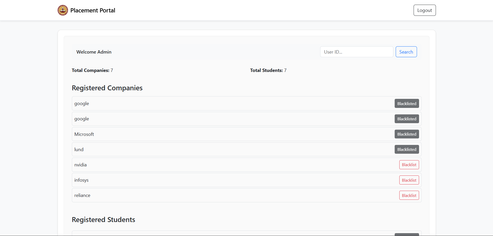
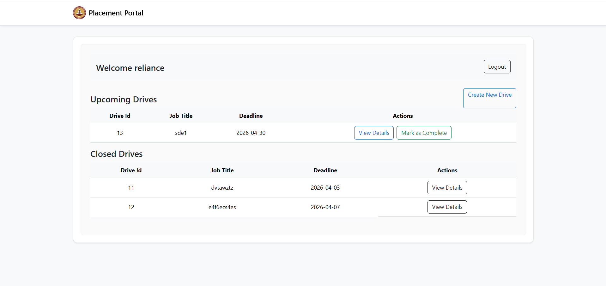
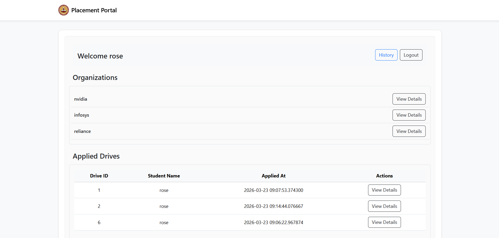

# 🎓 Placement Portal Application

> A role-based, full-stack web application designed to streamline and digitize the campus recruitment process — replacing spreadsheets and email chains with a structured, centralized platform.

<br>


---

## 📌 Table of Contents

- [Overview](#-overview)
- [Tech Stack](#-tech-stack)
- [Core Features](#-core-features)
- [Database Design](#-database-design)
- [Project Structure](#-project-structure)
- [Setup & Installation](#-setup--installation)
- [Default Admin Credentials](#-default-admin-credentials)
- [Screenshots](#-screenshots)
- [Demo](#-demo)
- [Future Improvements](#-future-improvements)
- [Academic Note](#-academic-note)

---

## 🧠 Overview

The **Placement Portal Application** is a full-stack web platform built to modernize the campus placement process for academic institutions. It eliminates the inefficiencies of manual coordination — such as tracking applications via spreadsheets or communicating through email threads — and replaces them with a structured, role-driven workflow.

The system supports three distinct user roles:

| Role | Description |
|------|-------------|
| 🏛️ **Admin** | Institute authority — manages users, approvals, and system oversight |
| 🏢 **Company** | Recruiter — posts drives, reviews applicants, and manages selections |
| 🎓 **Student** | Job seeker — browses drives, applies, and tracks application status |

Built as part of the **Modern Application Development – I** course, this project demonstrates end-to-end full-stack development capabilities including backend logic, database design, authentication, and a responsive UI.

---

## 🛠 Tech Stack

| Layer | Technology |
|-------|-----------|
| **Backend** | Python, Flask |
| **Frontend** | HTML5, CSS3, Bootstrap 5, Jinja2 |
| **Database** | SQLite (via Flask-SQLAlchemy) |
| **Authentication** | Flask-Login |
| **Password Hashing** | Werkzeug Security |
| **ORM** | Flask-SQLAlchemy |

> 📝 The database is created entirely programmatically via `db.create_all()` inside the app factory — no external DB tools, no manual schema setup, and no migrations required.

---

## 🧩 Core Features

### 🔐 Authentication & Authorization

- Unified login page with **role-based redirection** (Admin / Company / Student)
- Secure password hashing via **Werkzeug's** `generate_password_hash` / `check_password_hash`
- Session handling via **Flask-Login**
- Admin account is **auto-seeded on first run** — no public registration for Admin
- Company registration requires **Admin approval** before platform access is granted
- Route protection via login decorators — unauthorized access is blocked

---

### 👨‍💼 Admin Panel

The Admin acts as the gatekeeper of the entire system.

- 📊 **Dashboard** with live system statistics:
  - Total registered students
  - Total registered companies
  - Total placement drives posted
  - Total applications submitted
- ✅ **Approve or reject** company registration requests
- ✅ **Approve or reject** placement drives before they go live
- 👁️ View detailed profiles of students and companies
- 🚫 **Blacklist** company or student accounts when necessary

---

### 🏢 Company Panel

- 📝 Register and build a company profile (pending Admin approval)
- ➕ Create, edit, and delete placement drives
- 👥 View list of applicants per drive
- 🏷️ Update applicant statuses: **Shortlisted / Waiting / Rejected**
- 📋 Track the overall application pipeline per drive
- 👤 View individual student application details

---

### 🎓 Student Panel

- 📝 Register, log in, and manage personal profile
- 📄 Upload and update resume
- 🔎 Browse **only approved** placement drives
- 📬 Apply to drives (duplicate applications are strictly prevented)
- 📊 Track real-time application status: **Waiting / Shortlisted / Rejected**
- 🗂️ View full application history

---

### ⚙️ System Logic & Constraints

- 🔒 A student **cannot apply to the same drive twice** — enforced via a database-level `UniqueConstraint` on `(student_id, drive_id)`
- 🔒 Only **approved companies** can post placement drives
- 🔒 Students can only view drives that have been **approved by Admin**
- 🔄 Application lifecycle: `Waiting → Shortlisted → Rejected`
- 🛡️ Blacklisted accounts lose access without deletion — data integrity is preserved
- ⚙️ Admin is seeded automatically on startup — no registration endpoint exposed

---

## 🗄 Database Design

The database is created automatically on first run using `db.create_all()` inside the app factory (`app/__init__.py`). No manual setup or migration commands are required.

### Models & Fields

```
User                          [users]
├── id (PK, autoincrement)
├── name
├── email (unique)
├── password_hash
├── role                      # "admin" | "company" | "student"
├── is_active
└── created_at

StudentProfile                [student_profiles]
├── id (PK)
├── user_id (FK → users.id, unique)
├── student_name (FK → users.name)
├── education
├── skills
├── resume_path
├── is_blacklisted
└── created_at

CompanyProfile                [company_profiles]
├── id (PK)
├── user_id (FK → users.id, unique)
├── company_name (FK → users.name)
├── company_description
├── approval_status           # "Pending" | "Approved" | "Rejected"
├── is_blacklisted
└── created_at

PlacementDrive                [placement_drives]
├── id (PK)
├── company_id (FK → company_profiles.id)
├── company_name (FK → company_profiles.company_name)
├── job_title
├── job_description
├── eligibility
├── deadline
├── status                    # "Active" | "Closed"
└── created_at

Application                   [applications]
├── id (PK)
├── student_id (FK → student_profiles.id)
├── student_name (FK → student_profiles.student_name)
├── drive_id (FK → placement_drives.id)
├── status                    # "Waiting" | "Shortlisted" | "Rejected"
├── applied_at
└── UNIQUE CONSTRAINT on (student_id, drive_id)
```

### Relationships

```
User            ──1  StudentProfile     (One User → One Student Profile)
User            ──1  CompanyProfile     (One User → One Company Profile)
CompanyProfile  ──<  PlacementDrive    (One Company → Many Drives)
StudentProfile  ──<  Application       (One Student → Many Applications)
PlacementDrive  ──<  Application       (One Drive   → Many Applications)
```

---

## 📁 Project Structure

```
PLACEMENT-PORTAL-MAD1/
│
├── app/
│   ├── __init__.py                  # App factory — initializes Flask, SQLAlchemy,
│   │                                # seeds Admin, registers Blueprints
│   │
│   ├── config.py                    # App configuration (SECRET_KEY, DB URI)
│   │
│   ├── models/
│   │   ├── __init__.py              # Imports all models
│   │   ├── user.py                  # User model (shared auth table)
│   │   ├── student.py               # StudentProfile model
│   │   ├── company.py               # CompanyProfile model
│   │   ├── placement_drive.py       # PlacementDrive model
│   │   └── application.py           # Application model
│   │
│   ├── routes/
│   │   ├── __init__.py              # Exports all blueprints
│   │   ├── auth_routes.py           # Login, logout, register (student & company)
│   │   ├── admin_routes.py          # Admin dashboard, approvals, blacklisting
│   │   ├── company_routes.py        # Company dashboard, drives, applicants
│   │   └── student_routes.py        # Student dashboard, drive listing, applications
│   │
│   ├── templates/
│   │   ├── home.html                # Landing page
│   │   ├── login.html               # Shared login page
│   │   ├── register_student.html    # Student registration
│   │   ├── register_company.html    # Company registration
│   │   │
│   │   ├── admin/
│   │   │   ├── dashboard.html       # Admin stats & overview
│   │   │   ├── company_profile.html # Company detail & approval actions
│   │   │   ├── drive_details.html   # Drive detail view for admin
│   │   │   └── student_profile.html # Student detail & blacklist actions
│   │   │
│   │   ├── company/
│   │   │   ├── dashboard.html       # Company overview & drives list
│   │   │   ├── company_profile.html # Company's own profile view
│   │   │   ├── create_drive.html    # Create new placement drive form
│   │   │   ├── drive_applications.html  # List of applicants per drive
│   │   │   └── student_application.html # Individual student application detail
│   │   │
│   │   └── student/
│   │       ├── dashboard.html           # Student overview
│   │       ├── student_profile.html     # Student's own profile & resume upload
│   │       ├── drive_details.html       # View individual drive details
│   │       ├── company_profile.html     # View company info
│   │       └── applications_history.html # Full application history & statuses
│   │
│   └── static/
│       ├── css/                     # Custom stylesheets
│       ├── js/                      # Custom JavaScript
│       └── uploads/                 # Uploaded student resumes
│
├── instance/
│   └── placement.db                 # Auto-generated SQLite database
│
├── venv/                            # Virtual environment (not committed)
├── run.py                           # Application entry point
├── requirements.txt                 # Python dependencies
├── .gitignore
└── README.md
```

---

## 🚀 Setup & Installation

Follow these steps to run the project locally:

### 1. Clone the Repository

```bash
git clone https://github.com/your-username/placement-portal.git
cd placement-portal
```

### 2. Create a Virtual Environment

```bash
# On macOS/Linux
python3 -m venv venv
source venv/bin/activate

# On Windows
python -m venv venv
venv\Scripts\activate
```

### 3. Install Dependencies

```bash
pip install -r requirements.txt
```

### 4. Run the Application

```bash
python run.py
```

> ⚡ On first run, the database (`instance/placement.db`) is **created automatically** and the **Admin account is seeded** — no manual DB setup or migration commands needed.

### 5. Access the Application

Open your browser and navigate to:

```
http://127.0.0.1:5000
```

---

## 🔑 Default Admin Credentials

The Admin account is automatically created on the first run inside the app factory (`app/__init__.py`). Use these credentials to log in as Admin:

| Field | Value |
|-------|-------|
| **Email** | `admin@gmail.com` |
| **Password** | `admin@2005` |

> ⚠️ It is recommended to change the default credentials before deploying to any public or shared environment.

---

## 📸 Screenshots

### 🏛️ Admin Dashboard
<!-- Add screenshot here -->
```

```
> Displays system-wide stats: total students, companies, drives, and applications — with approval and blacklist management tools.

---

### 🏢 Company Dashboard
<!-- Add screenshot here -->
```

```
> Shows active placement drives, applicant lists per drive, and individual student status management.

---

### 🎓 Student Dashboard
<!-- Add screenshot here -->
```

```
> Displays available approved drives, application history with statuses, and profile/resume management.

---


## 📈 Future Improvements

The current version is a functional MVP. Planned enhancements for future iterations include:

| Feature | Description |
|---------|-------------|
| 🔌 **REST API** | Expose backend via RESTful API for mobile or SPA frontend integration |
| 📧 **Email Notifications** | Notify students and companies on status changes via automated emails |
| 📄 **Resume Parsing** | Auto-extract skills and details from uploaded resumes using NLP |
| 📊 **Analytics Dashboard** | Visual charts for placement trends, company activity, and student performance |
| ☁️ **Cloud Deployment** | Deploy on Render or AWS EC2 with a production-grade WSGI server (Gunicorn) |
| 🔍 **Advanced Filters** | Filter drives by eligibility criteria, deadline, and job title |
| 📱 **Enhanced Responsiveness** | Further optimize UI for seamless experience across all screen sizes |
| 🔐 **OAuth Integration** | Allow login via Google or LinkedIn for faster onboarding |

---

## 📜 Academic Note

> This project was developed as part of the **Modern Application Development – I** course requirement.
> It is intended for **academic and portfolio purposes only**.
> The codebase demonstrates full-stack web development skills including backend architecture, database design, role-based authentication, Blueprint-based routing, and a responsive Jinja2-rendered UI.

---

## 👨‍💻 Developer

**Developed by:** Solo Developer — Full Stack
**Scope:** Backend Logic · Database Design · Frontend UI · Authentication System · Route Architecture

---

## 📄 License

This project is developed for academic use. It is not licensed for commercial distribution.

---

<p align="center">
  <i>Built with ❤️ using Flask & Python — Modern Application Development I</i>
</p>
